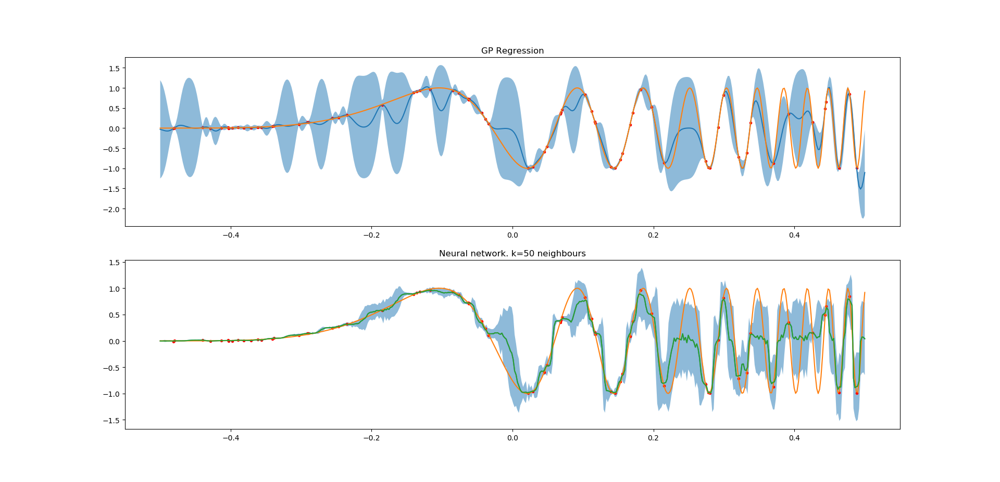

# ccnet
Project for using deep learning for nonlinear regression with few variables. Spatial interpolation etc.
## Requirements
-NumPy
-keras
-tensorflow

Examples use scikit-learn and matplotlib

## API

Initialize:
  cc=CCNet(nn,do_rate=0.1,id_dropout=0.02)

Fit model:
  cc.fit(X,Y,epochs=n_epochs,batch_size=batch_size,verbose=True)
Predict:

  Yp=cc.predict(Xp)
Or:
  Yp,ypstd=cc.stochastic_predict(Xp,n_iter=100)

## Example

