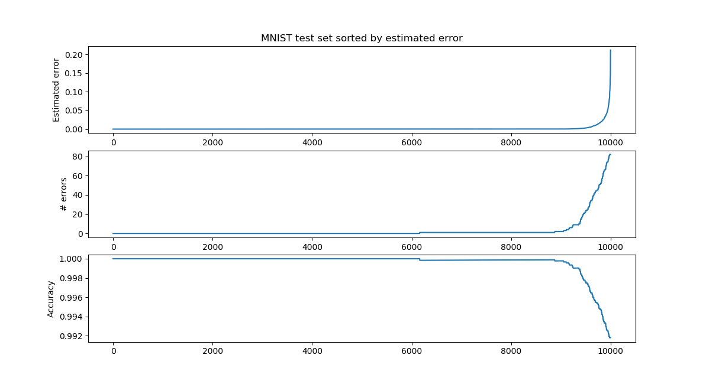

# ccnet
Project for using deep learning for nonlinear regression with few variables. Spatial interpolation etc.
## Requirements

-NumPy

-keras

-tensorflow

Examples use scikit-learn and matplotlib

## API

Initialize:

    cc=CCNet(num_neighbors=10,do_rate=0.1,id_dropout=0.02,shuffle=False,model=None)

Fit model:

    cc.fit(X,Y,epochs=n_epochs,batch_size=batch_size,verbose=True)
    
Predict:

    Yp=cc.predict(Xp)
Or:

    Yp,ypstd=cc.stochastic_predict(Xp,n_iter=100)

do_rate - Dropout. Drops one of the neighbours that is inputted into the model.

id_dropout - Additional Dropout on datapoint with distance 0 during fit.

shuffle - Shuffle order of the neighbors during stochastic predict and fit.

model - Supply own keras model. (See get_model() in model.py)

## MNIST Example

This example uses a 10D triplet-loss embedding of MNIST as input.
(https://github.com/omoindrot/tensorflow-triplet-loss is a good implementation of triplet loss if you want to try for yourself).

We see that we can predict on what test samples we will not be able to predict correctly, by using the dropout error.

## 1D Example

